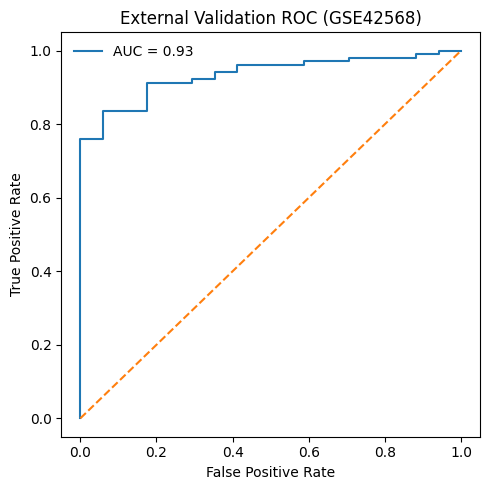
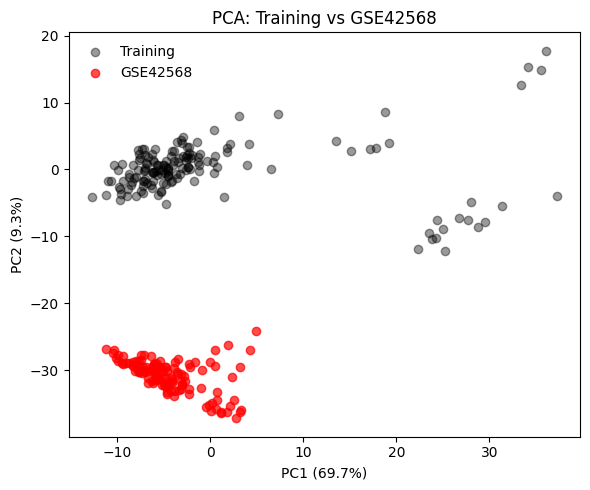

# Breast Cancer Gene Expression Predictor
by mikeph_

This project demonstrates a complete beginner-to-intermediate bioinformatics machine learning workflow using publicly available gene expression data from GEO.  
The goal is to classify **cancer vs normal samples** based on transcriptomic profiles and to practice proper evaluation, validation, and interpretation.

---

## Project Overview

- **Dataset:** GEO accession `GSE45827`
- **Task:** Binary classification (Cancer vs Normal)
- **Data type:** Microarray gene expression
- **Samples:** 155
- **Genes:** ~30,000
- **Model:** Logistic Regression
- **Language:** Python

---

## Dataset Description

- Source: **Gene Expression Omnibus (GEO)**
- Platform: Microarray
- Labels were extracted from `!Sample_characteristics_ch1` metadata
- Samples containing keywords such as **"cancer"** or **"tumor"** were labeled as cancer

---

## Methods

### Preprocessing
- Transposed expression matrix to `samples × genes`
- Converted all values to numeric
- Missing values filled using gene-wise means

### Feature Selection
- Removed low-variance genes using `VarianceThreshold`
- Reduced dimensionality from ~30,000 to ~200 genes

### Model
- Logistic Regression
- Evaluated using:
  - Train/test split
  - Stratified k-fold cross-validation
  - Permutation testing

---

## Results
### On Training Dataset:

| Metric | Value |
|------|------|
| Accuracy | 1.00 |
| ROC-AUC | 1.00 |
| CV ROC-AUC | 1.00 ± 0.00 |
| Permutation Test p-value | ~0.01 |

**Interpretation:**  
The classifier perfectly separates cancer and normal samples, indicating a strong biological signal in gene expression data. Permutation testing confirms that performance is statistically significant and not due to chance.

---

##  Visualizations

- **PCA plot** shows clear separation between cancer and normal samples
- **ROC curve** demonstrates near-perfect classification performance

---

## ⚠️ Notes on Evaluation

- ROC-AUC is **not defined for Leave-One-Out CV** in imbalanced datasets
- Accuracy was used instead for LOOCV
- This behavior is expected and reflects known statistical limitations

---

## Key Outputs

- `important_genes.csv`: genes ranked by logistic regression coefficients
- `expression_selected_genes.csv`: reduced feature matrix
- Exported train/test splits for reproducibility

---
## Results on external datasets
### On GSE42568:

| Metric | Value |
|------|------|
| Accuracy | 1.00 |
| ROC-AUC | 0.93 |
| CV ROC-AUC | 1.00 ± 0.00 |
| Permutation Test p-value | ~0.01 |

- ### ROC-AUC for GSE42568
  

- ### PCA for GSE 42568
  

- ### PCA Training Data vs GSE42568
  

---
## How to Run

```bash
conda create -n bio_ml python=3.11
conda activate bio_ml
pip install pandas numpy scikit-learn matplotlib

