# Gene Expression–Based Breast Cancer Classifier
by mikeph_

A bioinformatics machine learning workflow using publicly available gene expression data from GEO.  
The goal is to classify cancer vs normal samples based on transcriptomic profiles and to practice proper evaluation, validation, and interpretation.

---

## Project Overview

- **Dataset:** GEO accession `GSE45827`
- **Task:** Binary classification (Cancer vs Normal)
- **Data type:** Microarray gene expression
- **Samples:** 155
- **Genes:** ~30,000
- **Model:** Logistic Regression
- **Language:** Python

---

## Dataset Description

- Source: **Gene Expression Omnibus (GEO)**
- Platform: Microarray
- Labels were extracted from `!Sample_characteristics_ch1` metadata
- Samples containing keywords such as **"cancer"** or **"tumor"** were labeled as cancer

---

## Methods

### Preprocessing
- Transposed expression matrix to `samples × genes`
- Converted all values to numeric
- Missing values filled using gene-wise means

### Feature Selection
- Removed low-variance genes using `VarianceThreshold`
- Reduced dimensionality from ~30,000 to ~200 genes

### Model
- Logistic Regression
- Evaluated using:
  - Train/test split
  - Stratified k-fold cross-validation
  - Permutation testing

---

## Results
### On Training Dataset:

| Metric | Value |
|------|------|
| Accuracy | 1.00 |
| ROC-AUC | 1.00 |
| CV ROC-AUC | 1.00 ± 0.00 |
| Permutation Test p-value | ~0.01 |

**Interpretation:**  
The classifier perfectly separates cancer and normal samples, indicating a strong biological signal in gene expression data. Permutation testing confirms that performance is statistically significant and not due to chance.

---

##  Visualizations

- **ROC curve** demonstrates near-perfect classification performance

  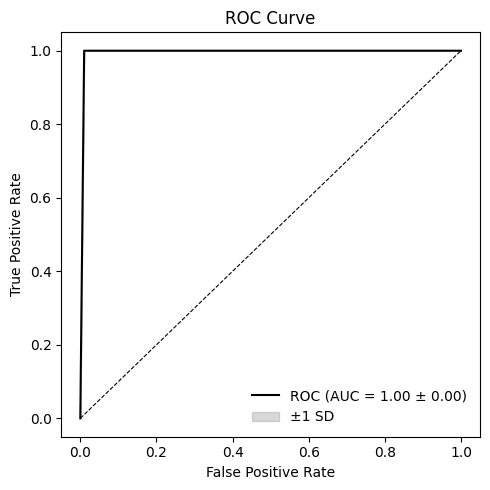

- **PCA plot** shows clear separation between cancer and normal samples

  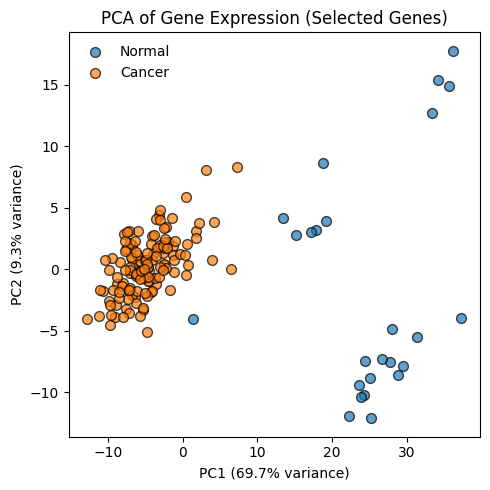

---

## ⚠️ Notes on Evaluation

- ROC-AUC is **not defined for Leave-One-Out CV** in imbalanced datasets
- Accuracy was used instead for LOOCV
- This behavior is expected and reflects known statistical limitations

---

## Key Outputs

- `important_genes.csv`: genes ranked by logistic regression coefficients
- `expression_selected_genes.csv`: reduced feature matrix
- Exported train/test splits for reproducibility

---
## Results on external datasets
## GSE42568:

[GEO NCBI](https://www.ncbi.nlm.nih.gov/geo/query/acc.cgi?acc=GSE42568)

  | Class        | Precision | Recall | F1‑score | Support |
  | ------------ | --------- | ------ | -------- | ------- |
  | 0            | 0.61      | 0.82   | 0.70     | 17      |
  | 1            | 0.97      | 0.91   | 0.94     | 104     |
  | Macro avg    | 0.79      | 0.87   | 0.82     | 121     |
  | Weighted avg | 0.92      | 0.90   | 0.91     | 121     |

- ### ROC-AUC
  

- ### PCA
  

- ### PCA Training Data vs GSE42568
  

---

## GSE61304:

[GEO NCBI](https://www.ncbi.nlm.nih.gov/geo/query/acc.cgi?acc=GSE61304)

- ### Characteristics
  ```
  Found characteristic rows: 11
  Selected diagnosis row index: 1
  Example diagnosis values: ['diagnosis: Adenocarcinoma of breast, ductal'
  'diagnosis: Adenocarcinoma of breast, ductal, mucinous'
  'diagnosis: Within normal limits'
  'diagnosis: Adenocarcinoma of breast, ductal'
  'diagnosis: Adenocarcinoma of breast, ductal']
  External labels (0=Normal, 1=Cancer): [ 4 58]
  Common genes: 200
  ```

  | Class        | Precision | Recall | F1‑score | Support |
  | ------------ | --------- | ------ | -------- | ------- |
  | 0            | 0.00      | 0.00   | 0.00     | 4       |
  | 1            | 0.93      | 0.86   | 0.89     | 58      |
  | Macro avg    | 0.46      | 0.43   | 0.45     | 62      |
  | Weighted avg | 0.87      | 0.81   | 0.84     | 62      |


- ### ROC-AUC
  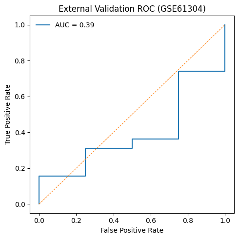

- ### PCA
  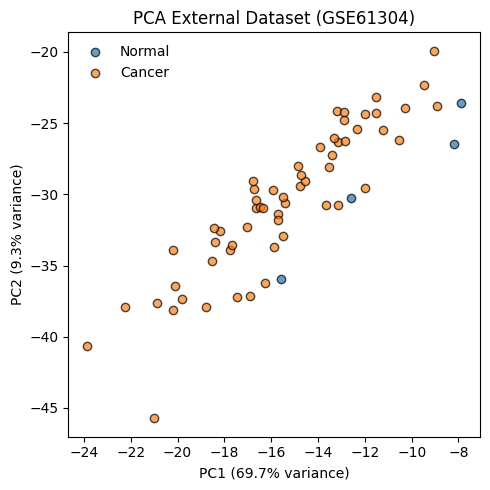

- ### PCA Training Data vs GSE61304
  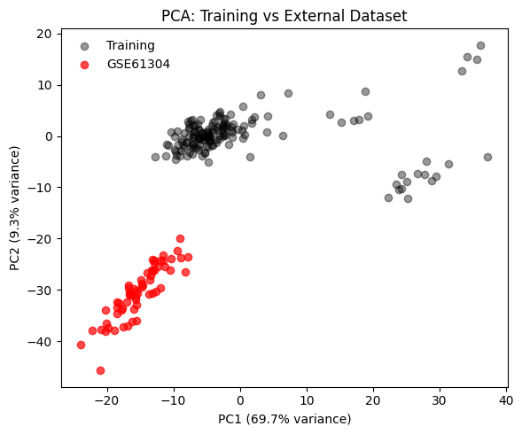

---

## GSE10810

[GEO NCBI](https://www.ncbi.nlm.nih.gov/geo/query/acc.cgi?acc=GSE10810)

- ### Characteristics
 
  ```
  Found characteristic rows: 8
  External labels (0=Normal, 1=Cancer): [27 31]
  Unique labels: [0 1]
  External data shape after aligning with training genes: (58, 200)
  Scaler expects features: 200
  External data successfully scaled.
  ```

  |            Class | Precision | Recall | F1-score | Support |
  | ---------------: | --------: | -----: | -------: | ------: |
  |                0 |      0.80 |   0.74 |     0.77 |      27 |
  |                1 |      0.79 |   0.84 |     0.81 |      31 |
  |     **Accuracy** |           |        | **0.79** |  **58** |
  |    **Macro Avg** |      0.79 |   0.79 |     0.79 |      58 |
  | **Weighted Avg** |      0.79 |   0.79 |     0.79 |      58 |

- ### ROC-AUC
  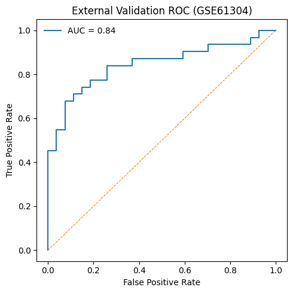

- ### PCA
  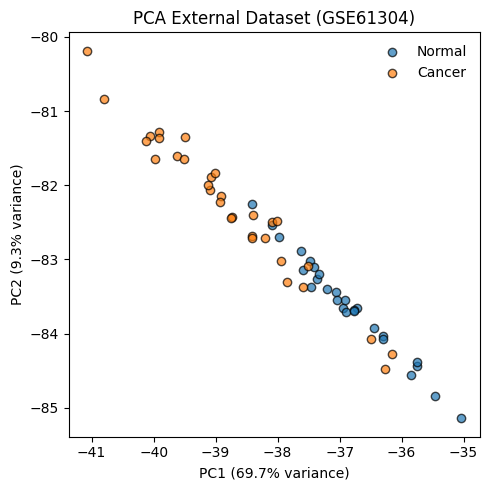

- ### PCA Training Data vs GSE61304
  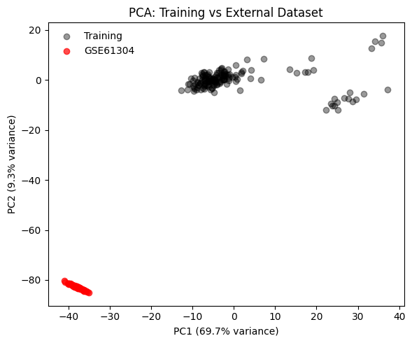

---

## GSE65194

[GEO NCBI](https://www.ncbi.nlm.nih.gov/geo/query/acc.cgi?acc=GSE65194)

- ### Characteristics
 
  ```
  Found characteristic rows: 4
  External labels (0=Normal, 1=Cancer): [ 11 153]
  Unique labels: [0 1]
  External data shape after aligning with training genes: (164, 200)
  Scaler expects features: 200
  External data successfully scaled.
  ```
**Best threshold for F1:** `0.9561`

| Class | Precision | Recall | F1-score | Support |
|------:|----------:|-------:|---------:|--------:|
| 0 (Normal) | 1.00 | 0.64 | 0.78 | 11 |
| 1 (Cancer) | 0.97 | 1.00 | 0.99 | 153 |
| **Accuracy** |  |  | **0.98** | **164** |
| **Macro avg** | **0.99** | **0.82** | **0.88** | **164** |
| **Weighted avg** | **0.98** | **0.98** | **0.97** | **164** |

- ### ROC-AUC
  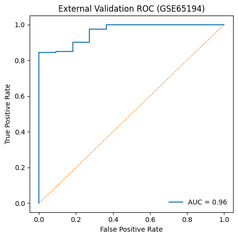

- ### PCA
  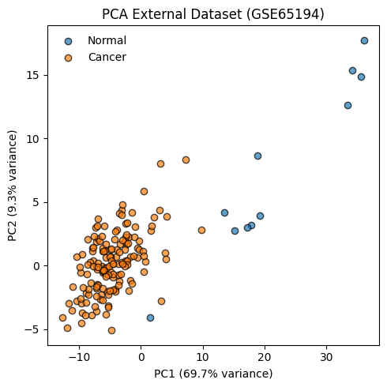

- ### PCA Training Data vs GSE61304
  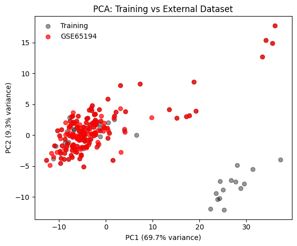

---

## How to Run

### Install depedencies

```bash
pip install depedencies.txt
```

### Download datasets

Because of the file limits of github, the datasets are available [here](https://drive.google.com/file/d/1yFVjjhgFVXe6DbVq7AIMXmPRPRV7bPEg/view?usp=sharing).
